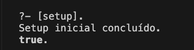
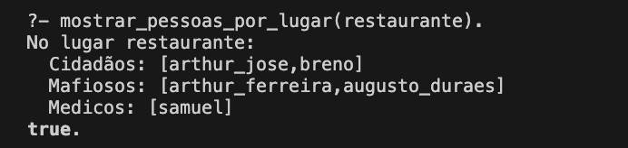
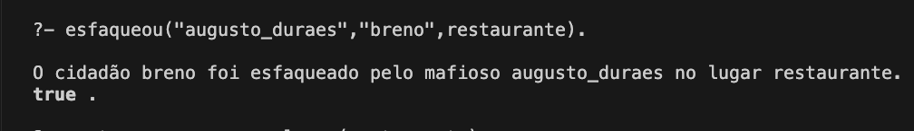
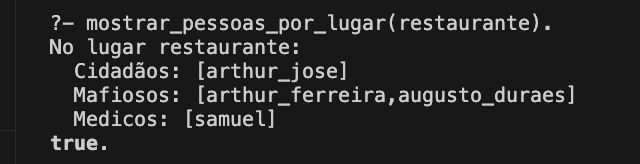

## Guia de Contribuição:

Para o projeto começar a rodar é preciso de pelo menos 3 elementos principais, cidadaos, mafiosos e medicos.

No caso foi definido as pessoas no arquivo [pessoas.txt](pessoas.txt), que sao atribuidas aleatoriamente pelo arquivo [carregar_funcoes.pl](carregar_funcoes.pl).

Para o prolog reconhecer os arquivos e as chamadas iniciais do projeto, precisamos declarar elas no arquivo [setup.pl](setup.pl) e logo após executar os comandos:

- **Para rodar o projeto basta entrar no swipl**: `swipl` ; 

- **(No Swipl) Para carregar o arquivo setup.pl**: `[setup].` ;

Assim todos arquivos e chamadas serão iniciadas.

## Exemplo de como rodar:

### Iniciando os arquivos e chamadas:

### Verificando pessoas no lugar:

### Criando uma ação pro jogo

### Verificando se o Breno sumiu mesmo

